# Agent Control Room

**English** · [Português (Brasil)](README.pt-BR.md)

[](https://github.com/FabianoArthur/agent-control-room/actions/workflows/ci.yml)
[](https://github.com/FabianoArthur/agent-control-room/actions/workflows/deploy.yml)
[](LICENSE)

A control room for coding agents working in parallel. You drop orders into a queue, free agents
pick them up, and each one works in its own branch and git worktree through plan, code, gates
(typecheck, lint, tests) and review until a pull request opens. When an agent is stuck it stops
and asks for you.

Everything runs in your browser from a **seeded, deterministic simulation**. There is no backend
and no API key, and the same seed always replays the same run.

**Live demo:** <https://fabianoarthur.github.io/agent-control-room/>
(try a shared run: [`?seed=2026&t=113`](https://fabianoarthur.github.io/agent-control-room/?seed=2026&t=113))


<details>
<summary>Light theme and phone layout</summary>


</details>

## Why it is interesting

- **Pure, replayable core.** The whole simulation is a reducer, `reduce(state, action) → state`.
  The PRNG (mulberry32) keeps its state *inside* the simulation state, so a tick is a pure
  function: same seed plus the same actions gives the same timeline. That is what makes the
  engine easy to test and a run easy to share (`?seed=<n>&t=<ticks>`).
- **A real workflow, simulated.** The model follows
  [claude-code-kitchen](https://github.com/FabianoArthur/claude-code-kitchen), a waiter/kitchen
  orchestration setup for Claude Code: a queue, one isolated worktree per task, deterministic
  gates before a PR, a retry when a gate fails, and a "needs you" pause when the spec is
  ambiguous. This repo is the visual, zero-infrastructure version of that flow.
- **Small and dependency-light.** React 19, Vite and TypeScript, with plain CSS and design tokens.
  No UI kit, no animation library, no state library.
- **Accessible by default.** Real buttons and labels, visible focus, `aria-live` for "needs
  you" alerts, keyboard-only use, `prefers-reduced-motion` and light/dark themes.

## How it works

<picture>
  <source media="(prefers-color-scheme: dark)" srcset="docs/assets/architecture-dark.svg">
  
</picture>

| Piece | What it does |
| --- | --- |
| `src/engine/engine.ts` | `createSimulation`, `reduce` and `fastForward`: scheduler, phases, gates, retries, pauses, PR numbers |
| `src/engine/rng.ts` | mulberry32 PRNG whose state is a single `uint32` stored in the simulation |
| `src/engine/scenario.ts` | The tunable script: phase durations, failure odds, order titles, log lines |
| `src/engine/params.ts` | Parses and clamps `?seed=` and `?t=` from the URL |
| `src/hooks/useSimulation.ts` | Drives the clock (pauses when the tab is hidden) and exposes actions |
| `src/ui/*` | Header, stats, agent cards, orders panel, activity feed |

Controls: **Play/Pause**, **step one tick** (while paused), **speed** 1×/2×/4×, **Autopilot** (a
simulated human answers a paused agent after 14 ticks; turn it off to unblock them yourself),
**restart with a new seed**, and the **theme** toggle.

## Run it locally

Requires Node 20.19+ (see `.nvmrc`).

```bash
npm ci
npm run dev        # http://localhost:5173
```

| Script | |
| --- | --- |
| `npm test` | Vitest: engine unit tests plus App smoke tests (jsdom) |
| `npm run lint` | ESLint (typescript-eslint strict, react-hooks) |
| `npm run typecheck` | `tsc -b` in strict mode |
| `npm run build` | Production build in `dist/`, with a Content-Security-Policy meta tag |

## Tests

The engine was built test-first. The suite covers determinism (same seed, same state; different
seed, different state; no mutation of the previous state), the scheduler (never more than
`maxParallel` agents, FIFO pickup), the full order lifecycle through to a unique PR number,
pauses that only a human or the autopilot can clear, input validation, log capping, URL parameter
parsing and the PRNG itself. A few App tests check the main interactions through the accessible
roles and labels. Layout is checked visually, not by unit tests.

## Deployment

`.github/workflows/deploy.yml` builds and publishes `dist/` to GitHub Pages on every push to
`main`. Vite uses `base: './'`, so the build works under any repository name. If the repository
is renamed, the demo URL changes with it.

CI (`.github/workflows/ci.yml`) runs lint, typecheck, tests and build, plus a full-history
gitleaks scan. Every action is pinned to a commit SHA and each job gets the minimum permissions.

## History

This repository started as a small Java command-line calculator. It has been rebuilt as Agent
Control Room; the Java code is still in the git history.

## License

[MIT](LICENSE) © 2026 Fabiano Arthur
