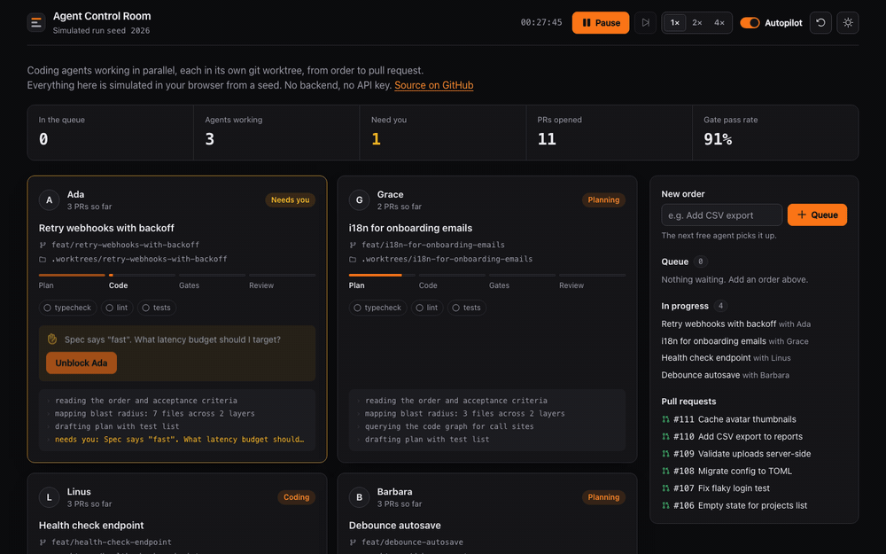
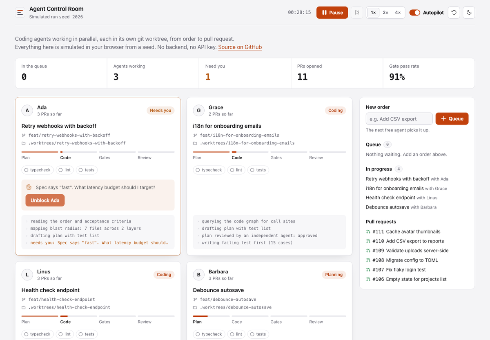
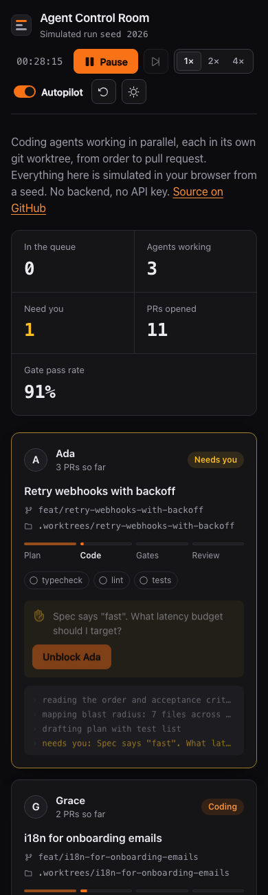

# Agent Control Room

[English](README.md) · **Português (Brasil)**

[](https://github.com/FabianoArthur/Calculadora/actions/workflows/ci.yml)
[](https://github.com/FabianoArthur/Calculadora/actions/workflows/deploy.yml)
[](LICENSE)

Uma sala de controle para agentes de código trabalhando em paralelo. Você coloca pedidos numa
fila, agentes livres os pegam, e cada um trabalha na própria branch e no próprio git worktree,
passando por plano, código, gates (typecheck, lint, testes) e revisão até abrir um pull request.
Quando um agente trava, ele para e chama você.

Tudo roda no navegador a partir de uma **simulação determinística com seed**. Não há backend nem
chave de API, e a mesma seed sempre repete a mesma execução.

**Demo ao vivo:** <https://fabianoarthur.github.io/Calculadora/>
(veja uma execução compartilhada: [`?seed=2026&t=113`](https://fabianoarthur.github.io/Calculadora/?seed=2026&t=113))



<details>
<summary>Tema claro e layout no celular</summary>





</details>

> A interface do app é em inglês; esta página descreve o projeto em português.

## Por que é interessante

- **Núcleo puro e reproduzível.** A simulação inteira é um reducer, `reduce(state, action) → state`.
  O PRNG (mulberry32) guarda o próprio estado *dentro* do estado da simulação, então um tick é uma
  função pura: mesma seed e mesmas ações dão a mesma linha do tempo. É isso que deixa o motor fácil
  de testar e uma execução fácil de compartilhar (`?seed=<n>&t=<ticks>`).
- **Um fluxo real, simulado.** O modelo segue o
  [claude-code-kitchen](https://github.com/FabianoArthur/claude-code-kitchen), uma orquestração
  garçom/cozinha para o Claude Code: uma fila, um worktree isolado por tarefa, gates
  determinísticos antes do PR, uma nova tentativa quando um gate falha e uma pausa "precisa de
  você" quando a especificação é ambígua. Este repositório é a versão visual, sem infraestrutura,
  desse fluxo.
- **Pequeno e com poucas dependências.** React 19, Vite e TypeScript, com CSS puro e design tokens.
  Sem kit de UI, sem biblioteca de animação, sem biblioteca de estado.
- **Acessível por padrão.** Botões e rótulos de verdade, foco visível, `aria-live` para os avisos
  de "precisa de você", uso só pelo teclado, `prefers-reduced-motion` e temas claro/escuro.

## Como funciona

<picture>
  <source media="(prefers-color-scheme: dark)" srcset="docs/assets/architecture.pt-BR-dark.svg">
  
</picture>

| Peça | O que faz |
| --- | --- |
| `src/engine/engine.ts` | `createSimulation`, `reduce` e `fastForward`: escalonador, fases, gates, novas tentativas, pausas, números de PR |
| `src/engine/rng.ts` | PRNG mulberry32 cujo estado é um único `uint32` guardado na simulação |
| `src/engine/scenario.ts` | O roteiro ajustável: duração das fases, chance de falha, títulos de pedidos, linhas de log |
| `src/engine/params.ts` | Lê e limita `?seed=` e `?t=` da URL |
| `src/hooks/useSimulation.ts` | Move o relógio (pausa quando a aba fica oculta) e expõe as ações |
| `src/ui/*` | Cabeçalho, métricas, cards dos agentes, painel de pedidos, feed de atividade |

Controles: **Play/Pause**, **avançar um tick** (pausado), **velocidade** 1×/2×/4×, **Autopilot**
(um humano simulado responde ao agente pausado depois de 14 ticks; desligue para destravar você
mesmo), **reiniciar com nova seed** e o botão de **tema**.

## Rodando localmente

Requer Node 20.19+ (veja `.nvmrc`).

```bash
npm ci
npm run dev        # http://localhost:5173
```

| Script | |
| --- | --- |
| `npm test` | Vitest: testes unitários do motor e testes de fumaça do App (jsdom) |
| `npm run lint` | ESLint (typescript-eslint strict, react-hooks) |
| `npm run typecheck` | `tsc -b` em modo strict |
| `npm run build` | Build de produção em `dist/`, com meta tag de Content-Security-Policy |

## Testes

O motor foi construído com testes primeiro. A suíte cobre determinismo (mesma seed, mesmo estado;
seed diferente, estado diferente; o estado anterior nunca é alterado), o escalonador (nunca mais
que `maxParallel` agentes, pedidos em ordem FIFO), o ciclo completo do pedido até um número de PR
único, pausas que só um humano ou o piloto automático liberam, validação de entrada, limite do log,
leitura dos parâmetros da URL e o próprio PRNG. Alguns testes do App conferem as interações
principais pelos papéis e rótulos acessíveis. O layout é conferido visualmente, não por teste
unitário.

## Deploy

`.github/workflows/deploy.yml` gera e publica `dist/` no GitHub Pages a cada push na `main`. O Vite
usa `base: './'`, então o build funciona com qualquer nome de repositório. Se o repositório for
renomeado, a URL da demo muda junto.

O CI (`.github/workflows/ci.yml`) roda lint, typecheck, testes e build, mais uma varredura do
gitleaks no histórico inteiro. Toda action está fixada por SHA de commit e cada job recebe só as
permissões mínimas.

## Histórico

Este repositório começou como uma pequena calculadora de linha de comando em Java. Ele foi
reconstruído como Agent Control Room; o código Java continua no histórico do git.

## Licença

[MIT](LICENSE) © 2026 Fabiano Arthur
